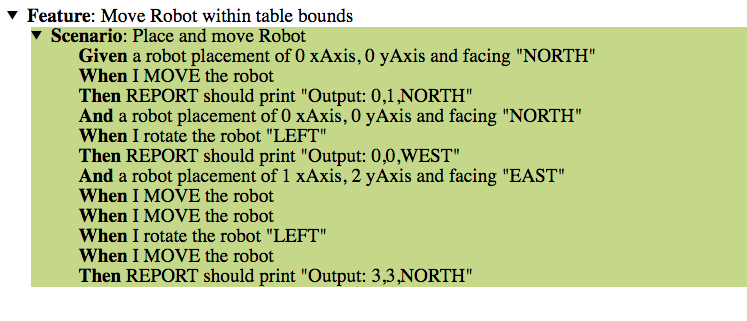

# Toy Robot Simulator

# Run it

## Acceptance test on CI Server

    mvn -P ci clean test
    
## Development test

    mvn clean test
      
## Build it

    mvn clean package

    java -jar toy-robot-simulator-console/target/toy-robot-simulator-console-1.0-SNAPSHOT.jar

# BDD Acceptance reports

### Console report can be found in the logs

### Full Html report can be found in the target dir

[Location here: toy-robot-simulator-acceptance/target/cucumber-reports/index.html](toy-robot-simulator-acceptance/target/cucumber-reports/index.html)

## Notes and Assumptions:

- Directions are always that of the Toy Robot not the player!
- Currently there is not user command to intuitively kill the app.
- Given that this is a Spring boot app, may be make more attempt at using more of spring features such as Spring's IoC container.
- Input text command interpretation is case sensitive.  Maybe it does not need to be. 

---

---

## Problem Domain Description

- The application is a simulation of a toy robot moving on a square tabletop, of dimensions 5 units x 5 units
- There are no other obstructions on the table surface
- The robot is free to roam around the surface of the table, but must be prevented from falling to destruction. Any movement that would result in the robot falling from the table must be prevented, however further valid movement commands must still be allowed
- You need to provide test data/results for the app & its logic

## 
Objectives
1. Create an application that can read in commands of the following form:
    - PLACE X,Y,F
    - MOVE
    - LEFT
    - RIGHT
    - REPORT
1. PLACE will put the toy robot on the table in position X,Y and facing NORTH, SOUTH, EAST or WEST
1. The origin (0,0) can be considered to be the SOUTH WEST most corner
1. The first valid command to the robot is a PLACE command, after that, any sequence of commands may be issued, in any order, including another PLACE command
1. The application should discard all commands in the sequence until a valid PLACE command has been executed
1. MOVE will move the toy robot one unit forward in the direction it is currently facing
1. LEFT and RIGHT will rotate the robot 90 degrees in the specified direction without changing the position of the robot
1. REPORT will announce the X,Y and F of the robot. This can be in any form, but standard output is sufficient
1. Input can be from a file, or from standard input, as the developer chooses
1. Provide test data to exercise the application

## Constraints:

1. The toy robot must not fall off the table during movement. This also includes the initial placement of the toy robot
1. Any move that would cause the robot to fall must be ignored
1. Example Input and Output:
    - PLACE 0,0,NORTH
    - MOVE
    - REPORT
      - Output: 0,1,NORTH
    - PLACE 0,0,NORTH
    - LEFT
    - REPORT
      - Output: 0,0,WEST
    - PLACE 1,2,EAST
    - MOVE
    - MOVE
    - LEFT
    - MOVE
    - REPORT
    - Output: 3,3,NORTH
